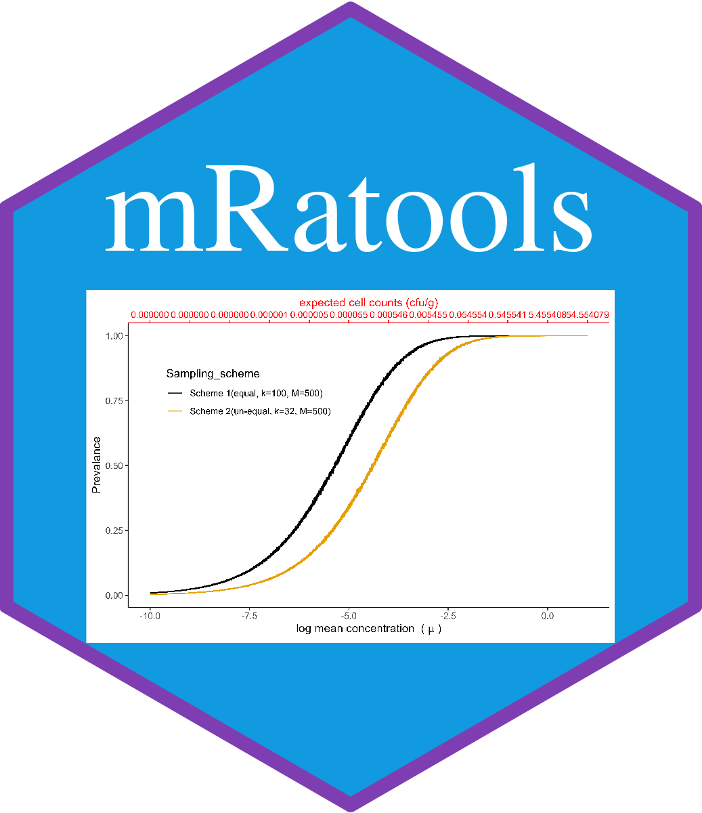

# Microbiological Risk Assessment Tools (mRatools)



<!-- badges: start -->

<!-- [](https://travis-ci.com/Mayooran1987/uneqmixr)-->

<!-- [[](https://github.com/Mayooran1987/mRatools/actions/workflows/r.yml)-->

[](https://github.com/Mayooran1987/mRatools/actions/workflows/rcmd.yml)
[](https://github.com/Mayooran1987/mRatools/actions/workflows/pages/pages-build-deployment)
<a href="https://github.com/Mayooran1987/mRatools/pulse" alt="Activity">
</a>

<!-- badges: end-->

## Overview

The package name 'mRatools' stands for Microbiological Risk Assessment Tools,
which currently includes four R packages. This package enables easy installation
and loading of four R packages for microbiological risk assessment. Also, a
description of this package's functions is available at <https://mayooran1987.github.io/mRatools/reference/index.html>.

More R packages for microbiological risk assessment are planned and added to
this wrapper package. The following Packages are currently wrapped in the
'mRatools' package:

1.  [grabsampling](https://mayooran1987.github.io/grabsampling/) - The goal of
    'grabsampling' package is to enable probability of detection calculation for
    grab samples selection by using two different methods such as systematic or
    random based on two-state Markov chain in bulk production process.

2.  [mixingsimulation](https://mayooran1987.github.io/mixingsimulation/) - The
    goal of 'mixingsimulation' is to develop simulated results and creation of
    graphical displays for different mixing plans.

3.  [uneqmixr](https://mayooran1987.github.io/uneqmixr/index.html) - The
    'uneqmix' package aims to develop Monte-Carlo estimates of probabilities
    associated with risk assessment when aggregating unequal incremental
    samples. Also, the package provides graphical displays for different various
    sampling schemes.

4.  [dilutionrisk](https://mayooran1987.github.io/dilutionrisk/) - The
    'dilutionrisk' package aims to develop Monte-Carlo estimates of
    probabilities and graphical displays in the study associated with modelling
    and assessment of risk based on aerobic plate count (APC) on diluted
    testing.

## Installation

Any R user can install the development version of mRatools package from
[GitHub](https://github.com/) with just two lines of code:

``` r
# Install the development version from GitHub
# install.packages("devtools")
devtools::install_github("Mayooran1987/mRatools")
```

## User manual

This package's user manual can be seen at
<https://github.com/Mayooran1987/mRatools/blob/main/mRatools_0.0.1.pdf>


## Acknowledgement

I would like to express my sincere gratitude to my supervisors, Dr K. Govindaraju and Prof. Mark Bebbington, for their invaluable guidance, support, and feedback during the development of this R package. Their expertise and insights have been instrumental in shaping the package and ensuring its quality.
